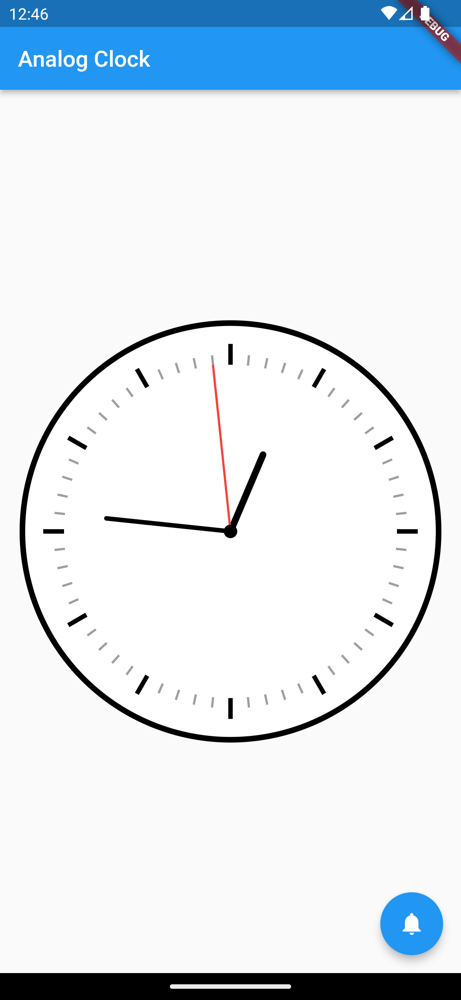

Certainly! Here's the updated code for the `ClockPainter` class along with its explanation in a README file:

```dart
/// ClockPainter Class
///
/// This class is responsible for painting the analog clock face
/// and the clock hands based on the current time.
class ClockPainter extends CustomPainter {
  final DateTime time;

  ClockPainter(this.time);

  @override
  void paint(Canvas canvas, Size size) {
    final centerX = size.width / 2;
    final centerY = size.height / 2;
    final center = Offset(centerX, centerY);
    final radius = centerX;

    // Draw clock face
    final facePaint = Paint()..color = Colors.white;
    final borderPaint = Paint()
      ..color = Colors.black
      ..style = PaintingStyle.stroke
      ..strokeWidth = 2.0;
    canvas.drawCircle(center, radius, facePaint);
    canvas.drawCircle(center, radius, borderPaint);

    // Draw hour numbers
    final textStyle = TextStyle(
      color: Colors.black,
      fontSize: 16.0,
      fontWeight: FontWeight.bold,
    );
    final textPainter = TextPainter(
      textDirection: TextDirection.ltr,
      textAlign: TextAlign.center,
    );
    final hourRadius = radius * 0.7;
    final hourHighlightRadius = radius * 0.85;
    for (int i = 1; i <= 12; i++) {
      final angle = i * 30 * pi / 180;
      final hourText = i.toString();
      textPainter.text = TextSpan(text: hourText, style: textStyle);
      textPainter.layout();
      final textX = centerX + cos(angle) * hourRadius - textPainter.width / 2;
      final textY = centerY + sin(angle) * hourRadius - textPainter.height / 2;
      textPainter.paint(canvas, Offset(textX, textY));

      if (time.hour == i) {
        final highlightPaint = Paint()
          ..color = Colors.blue
          ..strokeWidth = 2.0;
        final highlightX = centerX + cos(angle) * hourHighlightRadius;
        final highlightY = centerY + sin(angle) * hourHighlightRadius;
        canvas.drawCircle(Offset(highlightX, highlightY), 6.0, highlightPaint);
      }
    }

    // Draw minute numbers
    final minuteRadius = radius * 0.85;
    final minuteHighlightRadius = radius * 0.9;
    for (int i = 0; i < 60; i += 5) {
      final angle = i * 6 * pi / 180;
      final minuteText = i.toString();
      textPainter.text = TextSpan(text: minuteText, style: textStyle);
      textPainter.layout();
      final textX = centerX + cos(angle) * minuteRadius - textPainter.width / 2;
      final textY = centerY + sin(angle) * minuteRadius - textPainter.height / 2;
      textPainter.paint(canvas, Offset(textX, textY));

      if (time.minute == i) {
        final highlightPaint = Paint()
          ..color = Colors.blue
          ..strokeWidth = 2.0;
        final highlightX = centerX + cos(angle) * minuteHighlightRadius;
        final highlightY = centerY + sin(angle) * minuteHighlightRadius;
        canvas.drawCircle(Offset(highlightX, highlightY), 4.0, highlightPaint);
      }
    }

    // Draw hour hand
    final hourHandPaint = Paint()
      ..color = Colors.black
      ..strokeCap = StrokeCap.round
      ..strokeWidth = 6.0;
    final hourHandLength = radius * 0.4;
    final hourRadians =
        (time.hour * 30 + (time.minute / 2) - 90) * (pi / 180);
    final hourHandX = centerX + cos(hourRadians) * hourHandLength;
    final hourHandY = centerY + sin(hourRadians) * hourHandLength;
    canvas.drawLine(center, Offset(hourHandX, hourHandY), hourHandPaint);

    // Draw minute hand
    final minuteHandPaint = Paint()
      ..color = Colors.black
      ..strokeCap = StrokeCap.round
      ..strokeWidth = 4.0;
    final minuteHandLength = radius * 0.6;
    final minuteRadians = (time.minute * 6 - 90) * (pi / 180);
    final minuteHandX = centerX + cos(minuteRadians) * minuteHandLength;
    final minuteHandY = centerY + sin(minuteRadians) * minuteHandLength;
    canvas.drawLine(center, Offset(minuteHandX, minuteHandY), minuteHandPaint);

    // Draw second hand
    final secondHandPaint = Paint()
      ..color = Colors.red
      ..strokeCap = StrokeCap.round
      ..strokeWidth = 2.0;
    final secondHandLength = radius * 0.8;
    final secondRadians = (time.second * 6 - 90) * (pi / 180);
    final secondHandX = centerX + cos(secondRadians) * secondHandLength;
    final secondHandY = centerY + sin(secondRadians) * secondHandLength;
    canvas.drawLine(center, Offset(secondHandX, secondHandY), secondHandPaint);

    // Draw center point
    final centerPointPaint = Paint()..color = Colors.black;
    canvas.drawCircle(center, 6.0, centerPointPaint);
  }

  @override
  bool shouldRepaint(CustomPainter oldDelegate) {
    return true;
  }
}
```

## Analog Clock with Highlighted Hour and Minute Numbers

This Flutter code provides an analog clock widget with highlighted hour and minute numbers. The `ClockPainter` class is responsible for painting the clock face and the clock hands based on the current time.

### How to Use

1. Create a Flutter project and replace the default `lib/main.dart` file with the following code:

```dart
import 'package:flutter/material.dart';
import 'dart:async';
import 'dart:math';

void main() {
  runApp(MyApp());
}

class MyApp extends StatelessWidget {
  @override
  Widget build(BuildContext context) {
    return MaterialApp(
      title: 'Analog Clock',
      theme: ThemeData(
        primarySwatch: Colors.blue,
      ),
      home: ClockScreen(),
    );
  }
}

class ClockScreen extends StatefulWidget {
  @override
  _ClockScreenState createState() => _ClockScreenState();
}

class _ClockScreenState extends State<ClockScreen> {
  DateTime _currentTime = DateTime.now();

  @override
  void initState() {
    super.initState();
    _startClock();
  }

  void _startClock() {
    Timer.periodic(Duration(seconds: 1), (timer) {
      setState(() {
        _currentTime = DateTime.now();
      });
    });
  }

  @override
  Widget build(BuildContext context) {
    return Scaffold(
      appBar: AppBar(
        title: Text('Analog Clock'),
      ),
      body: Center(
        child: AspectRatio(
          aspectRatio: 1,
          child: Container(
            padding: EdgeInsets.all(20),
            decoration: BoxDecoration(
              shape: BoxShape.circle,
              color: Colors.white,
              boxShadow: [
                BoxShadow(
                  color: Colors.black.withOpacity(0.1),
                  blurRadius

: 10,
                  offset: Offset(0, 5),
                ),
              ],
            ),
            child: CustomPaint(
              painter: ClockPainter(_currentTime),
            ),
          ),
        ),
      ),
    );
  }
}
```

2. Create a new file called `lib/clock_painter.dart` and paste the `ClockPainter` class code inside it.

3. Run the Flutter project using `flutter run` command.

The analog clock will be displayed with highlighted hour and minute numbers. The clock hands will update in real-time.

Feel free to customize the appearance, adjust the colors or sizes, or add any additional features you desire.

I hope this README file helps you understand and utilize the analog clock with highlighted hour and minute numbers.

